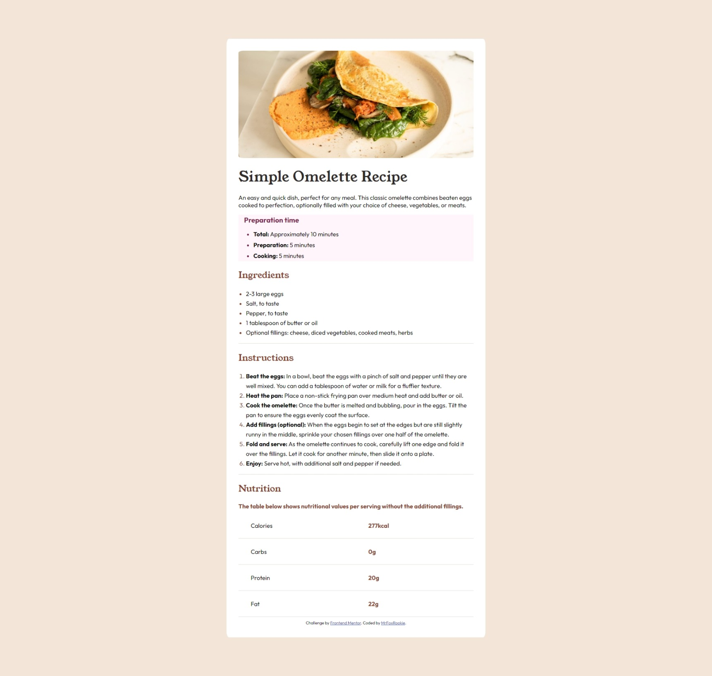

# Frontend Mentor - Recipe page solution

This is a solution to the [Recipe page challenge on Frontend Mentor](https://www.frontendmentor.io/challenges/recipe-page-KiTsR8QQKm). Frontend Mentor challenges help you improve your coding skills by building realistic projects. 

## Table of contents

- [Overview](#overview)
  - [The challenge](#the-challenge)
  - [Screenshot](#screenshot)
  - [Links](#links)
- [My process](#my-process)
  - [Built with](#built-with)
  - [What I learned](#what-i-learned)
  - [Continued development](#continued-development)
  - [Useful resources](#useful-resources)
- [Author](#author)
- [Acknowledgments](#acknowledgments)

**Note: Delete this note and update the table of contents based on what sections you keep.**

## Overview

### Screenshot

### Links

- Solution URL: [Add solution URL here](https://github.com/MrFoxRookie/Frontend-Mentor-MrFoxRookie-s-Repository-)
- Live Site URL: [Add live site URL here](https://your-live-site-url.com)

## My process

### Built with

- Semantic HTML5 markup
- CSS custom properties
- Flexbox

### What I learned

During this project I mainly learned to be extremely patient, as I had to try several times with different codes to finally get the desired results.*

### Continued development

I would like to continue improving the optimization of the code itself in order to not have to write unnecessary lines, which will not only save time but also make the code easier to read.

### Useful resources

## Author

- Frontend Mentor - [@MrFoxRookie](https://www.frontendmentor.io/profile/MrFoxRookie)
- Twitter - [@yMrFoxRookie](https://github.com/MrFoxRookie)

## Acknowledgments
